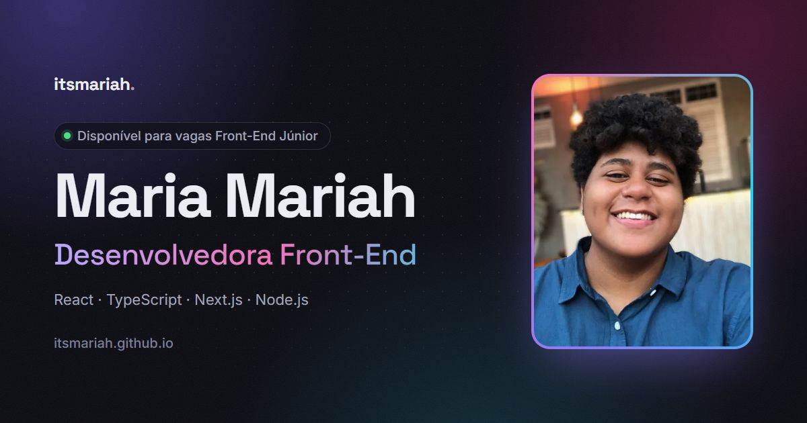

<div align="center">

<a href="https://itsmariah.github.io/"></a>

# itsmariah.github.io

Portfólio de **Maria Mariah**, desenvolvedora front-end. Feito do zero com React e TypeScript, com foco em animações que não pesam, acessibilidade e performance.

[](https://github.com/itsmariah/itsmariah.github.io/actions/workflows/deploy.yml)
[](https://github.com/itsmariah/itsmariah.github.io/actions/workflows/ci.yml)

**[Ver o site →](https://itsmariah.github.io/)**

</div>

> **English:** Personal portfolio built from scratch with React 19, TypeScript and Vite. Highlights: light/dark themes with an animated View Transition, a ⌘K command palette, shareable project links, live GitHub activity, PT/EN with browser-language detection, 37 automated tests, and Lighthouse 99 (desktop) / 92 (mobile) for performance with 100 in accessibility, best practices and SEO.

---

## O que tem aqui

**Visual e interação**
- Tema claro e escuro, cada um com personalidade própria (aurora animada, grade de pontos, granulação), e troca de tema com um círculo que se expande a partir do botão (View Transitions API)
- Hero com o nome entrando letra por letra, cargo alternando, foto com inclinação 3D e botão magnético
- Brilho que segue o mouse nos cards, na cor da marca de cada tecnologia
- Navbar em pílula de vidro com indicador deslizante e barra de progresso de leitura
- **Paleta de comandos** (`Ctrl K` / `⌘K`) para navegar, trocar tema e idioma, copiar o e-mail e baixar o currículo

**Projetos**
- Cada projeto tem link próprio (`/#projeto/geldtrack`), e o botão "voltar" do navegador fecha o modal
- Prévia animada no hover com as imagens da galeria
- "Atualizado há 2 dias": último push de cada repositório, lido da API do GitHub, com cache
- Seção "do problema ao resultado" contando a história de cada projeto

**Detalhes**
- Português e inglês, abrindo no idioma do navegador
- Imagem de compartilhamento própria para LinkedIn e WhatsApp, e página 404 no mesmo estilo
- Alguns segredos para quem gosta de explorar 👀

## Qualidade

| Lighthouse | Performance | Acessibilidade | Boas práticas | SEO |
|---|:-:|:-:|:-:|:-:|
| Desktop | 99 | 100 | 100 | 100 |
| Mobile | 92 | 100 | 100 | 100 |

<sub>Medido com o Lighthouse 12 sobre o build de produção (mobile: mediana de 3 execuções, com CPU e rede simuladas). LCP de 0,6 s no desktop e CLS 0 nos dois.</sub>

- **37 testes** com Vitest e Testing Library: lógica pura (busca da paleta, datas relativas, detecção de sequência), integridade dos dados (toda imagem e PDF citados existem, PT e EN têm as mesmas chaves e variáveis), rota dos projetos e a paleta de comandos de ponta a ponta
- **CI no GitHub Actions:** checagem de tipos e testes em todo push e pull request. O deploy na main só acontece se os dois passarem
- **TypeScript estrito**, com `noUnusedLocals` e `noUnusedParameters`

## Decisões técnicas

**Animações que não pesam.** Tudo o que anima sem parar usa só `transform` e `opacity`, que o navegador resolve na GPU sem repintar a página. A borda girando da foto, por exemplo, é um quadrado com gradiente cônico girando por trás de uma moldura com `overflow: hidden`. Animar o ângulo do gradiente seria mais simples, mas obrigaria a repintar a cada quadro: trocar uma coisa pela outra cortou o tempo de pintura no mobile em cerca de 5x. Com "reduzir movimento" ativado no sistema, as animações param.

**Carregamento enxuto.** Os componentes usam a versão leve do Motion (`m.*` com `LazyMotion` em modo `strict`), e os recursos de animação chegam depois da primeira pintura. A paleta de comandos e o modal de projeto são carregados sob demanda e pré-carregados quando o navegador fica ocioso. A foto do hero é servida em AVIF, com tamanho escolhido pelo navegador (`srcset`) e preload. O JS inicial tem ~145 KB comprimido.

**Acessibilidade de verdade.** A paleta segue o padrão de combobox do WAI-ARIA (`aria-activedescendant`, navegação por setas). Os modais prendem o foco e o devolvem ao fechar. Os toasts são anunciados por `aria-live`, e o texto animado do hero tem uma versão estática para leitores de tela. Também há link de "pular para o conteúdo" e contraste AA validado nos dois temas.

**Sem framework de CSS.** O design system é feito de variáveis CSS (cores, raios, sombras, curvas de animação) redefinidas por tema em `[data-theme]`. Um script inline aplica tema e idioma antes da primeira pintura, então não há "piscada".

**Conteúdo como dados.** Projetos, tecnologias, trajetória e certificados ficam em arquivos TypeScript tipados em `src/data/`. Adicionar um projeto é editar um único arquivo, e os testes avisam se faltar uma imagem ou uma tradução.

## Stack

React 19 · TypeScript 7 · Vite 8 · Motion · Vitest · Testing Library · Lucide · Simple Icons · Fontsource · GitHub Actions · GitHub Pages

## Rodando localmente

Precisa do Node.js 24.

```bash
npm ci
npm run dev        # servidor de desenvolvimento
npm test           # testes (npm run test:watch para modo observação)
npm run typecheck  # checagem de tipos
npm run build      # build de produção em dist/
npm run preview    # serve o build localmente
```

## Estrutura

```
src/
├── components/      # seções da página, paleta de comandos, toast, 404
│   ├── hero/        # nome animado, cargo alternando, foto 3D, botão magnético
│   └── projects/    # destaques, cards, modal, prévia, atividade do GitHub
├── data/            # conteúdo: projetos, tecnologias, trajetória, certificados
├── hooks/           # tema, rota dos projetos, tilt, spotlight, área de transferência…
├── i18n/            # dicionários PT/EN e provider
├── utils/           # funções puras (busca, datas relativas, sequência de teclas)
├── effects/         # confete em canvas
├── styles/          # design tokens e estilos globais
└── test/            # setup dos testes
scripts/             # geração da imagem de compartilhamento e das variantes da foto
```

**Scripts auxiliares**
- `scripts/og-image.html`: modelo da imagem de compartilhamento. O comando para regerar `public/og-image.jpg` está no comentário do arquivo
- `scripts/hero-images.py`: gera as variantes AVIF/WebP da foto do hero (`python scripts/hero-images.py`, precisa do Pillow 11+)

## Contato

[LinkedIn](https://www.linkedin.com/in/maria-mariah-queiroga-508757182/) · [mariamariahqfs@gmail.com](mailto:mariamariahqfs@gmail.com) · [itsmariah.github.io](https://itsmariah.github.io/)
